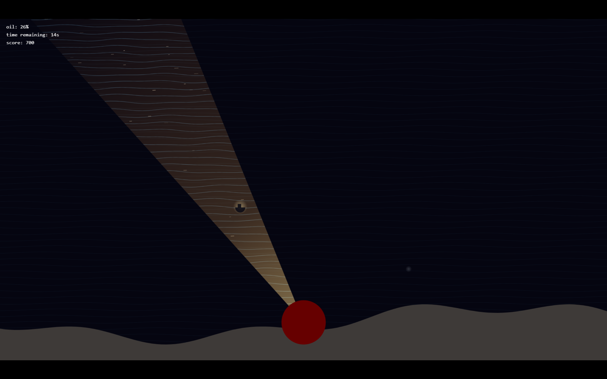

# The Last Lighthouhse Keeper

A browser game made with HTML/CSS/JS (vanilla) and canvas.

## Description

In this game, you control the direction of a lighthouse beam during the night. The goal is to use the beam to detect and help ships while managing the limited oil supply. Ships appear in random positions and if you hold the beam long enough on them, they get "resolved" (helped). The goal of the game is to stay for 60 seconds without running out of oil (you lose when oil reaches 0%)
The game also features an animated ocean only using canvas and sine waves and oil, score and countdown system. 

### Screenshots


## Getting Started

### Dependencies

No libraries needed, it's pure vanilla JS, you just need a browser.

### Installing

You can clone the repository:
```
git clone https://github.com/ElyassCreates/Keeper.git
cd Keeper
```

### Executing program

You can either:
-  open the HTML file with your browser
-  run it through a local web server:
    ```
    python -m http.server
    ```
    and open `http://localhost:8000`

## License

This project is licensed under the MIT License - see the [LICENSE](LICENSE) file for details.